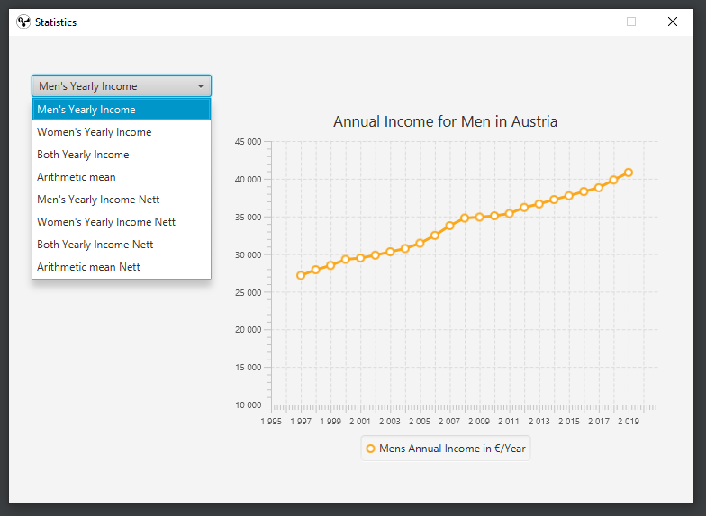
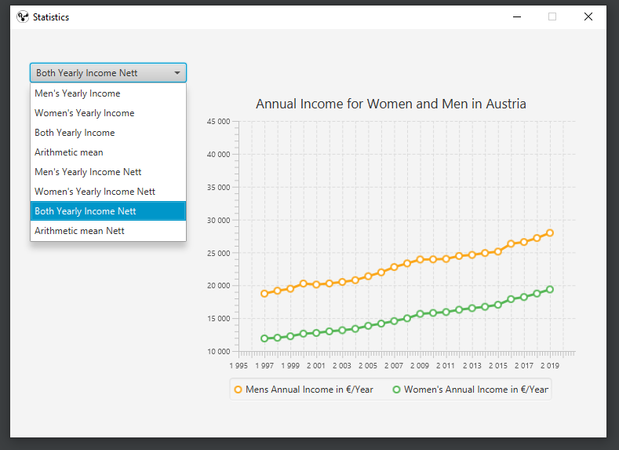
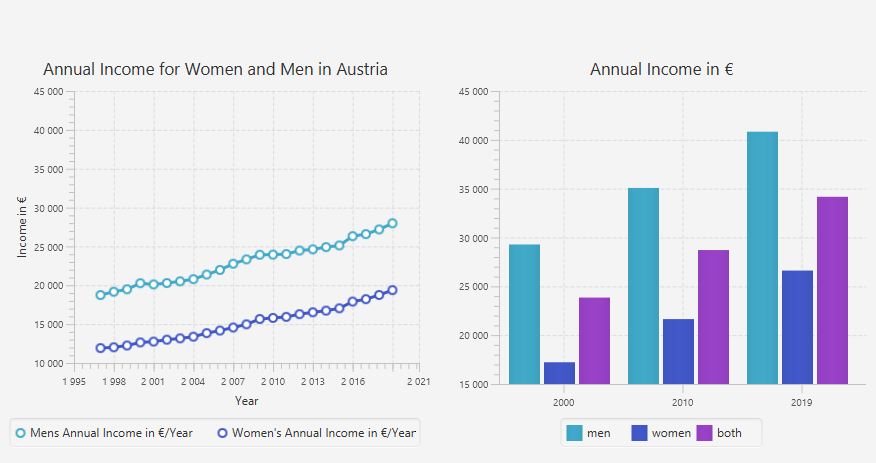

# Javafx gui for visualising the annual income per person in austria

#### Source for the statistics: 
https://www.statistik.at/web_de/statistiken/menschen_und_gesellschaft/soziales/personen-einkommen/jaehrliche_personen_einkommen/index.html

### Setup on IntelliJ

Java version: adopt-openjdk-11

Javafx: javafx-sdk-11.0.2

1. open project in IDE 

2. got to File -> project structures -> libraries and add the /lib folder path from your javafx sdk

3. Before you run the Main class, make sure to add VM options in your launcher.

write:

    --module-path "yourPath/.jdks/javafx-sdk-11.0.2/lib" --add-modules javafx.controls,javafx.fxml

4. Now you scan start your JavaFx application

### See the Statistiscs

